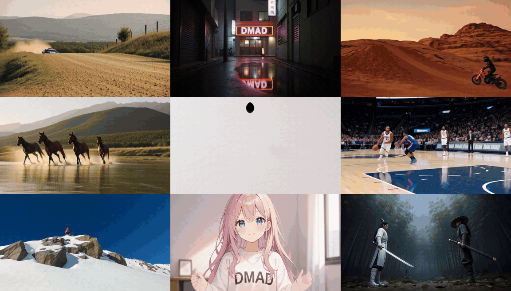

# DMAD: Distribution Matching as Adversarial Distillation for Fast Visual Generation

### 4-step MiniMax-H3 students for joint audio-video generation

[](https://yzmblog.github.io/projects/DMAD/)
[](https://arxiv.org/abs/2610.02188)
[](https://huggingface.co/ZhengmingYu/DMAD)
[](https://www.youtube.com/watch?v=cOCUCYZzAtE)

[Zhengming Yu](https://yzmblog.github.io/)<sup>1,2</sup>,
[Junkun Yuan](https://junkunyuan.github.io/)<sup>2</sup>,
[Haotian Yang](https://yanght321.github.io/)<sup>2</sup>,
[Gordon Guocheng Qian](https://guochengqian.github.io/)<sup>2</sup>,
[Yizhi Wang](https://yizhiwang96.github.io/)<sup>2</sup>,
[Angtian Wang](https://angtianwang.github.io/)<sup>2</sup>,
[Yiding Yang](https://ihollywhy.github.io/)<sup>2</sup>,
[Bo Liu](https://scholar.google.com/citations?user=NOgz-HsAAAAJ&hl=en)<sup>2</sup>,
[Xin Li](https://people.tamu.edu/~xinli/)<sup>1</sup>,
[Wenping Wang](https://engineering.tamu.edu/cse/profiles/Wang-Wenping.html)<sup>1</sup>,
[Chongyang Ma](http://www.chongyangma.com/)<sup>2</sup><br/>
<sup>1</sup>Texas A&amp;M University, <sup>2</sup>ByteDance<br/>

<p align="center">
  
</p>

This repository contains the **4-step DMAD students of [MiniMax-H3](https://huggingface.co/MiniMaxAI/MiniMax-H3)
(33B, text-to-audio-video)** and the code to run them: a LoRA of rank 128 on the H3 transformer turns the 50-step
teacher into a 4-step generator of 1344x768 video with native stereo audio.

## 📝 Abstract

> Distribution Matching Distillation (DMD) trains a few-step student on the difference between target and student
> scores, so it must keep an auxiliary diffusion model fitted to the student's evolving distribution at extra memory
> and computation cost. We introduce DMAD, **Distribution Matching as Adversarial Distillation**, which recasts
> distribution matching as classification and learns the required log-density ratios directly. Two discriminator
> heads on a shared backbone distinguish real data and teacher samples from the student's, and linear losses on their
> logits train the student without auxiliary score fitting. We prove that at the discriminator optimum these losses
> recover the distribution-matching gradient underlying DMD, through the classical identity linking discriminator
> logits to log-density ratios. We further introduce gap-based reweighting, which adapts teacher supervision across
> noise levels from the real-data head's empirical logit gap between real and teacher samples. DMAD reaches a Fréchet
> Inception Distance (FID) of 1.04 with one-step generation on ImageNet-64x64, 14.47 with four-step SDXL on COCO-10K,
> and a VBench total score of 85.15 with four-step Wan2.1-T2V-14B, the best values among the compared few-step
> methods and the multi-step teachers. On MiniMax-H3-33B, our four-step student achieves overall human preference
> rates of 79.1% over DMD2 and 84.6% over rCM for joint audio-video generation, excluding ties.

This repository contains:

* 🪐 Two DMAD student LoRAs (rank 128, 1.4 GB each): `lora_critic` (the checkpoint of the paper) and `full_critic` (a full-critic variant that scores higher on AVGen-Bench)
* ⚡️ [`inference.py`](inference.py): few-step sampling with the re-noise step rule the students were trained with
  (the sampler of all results in the paper), on one 80 GB GPU or, with `--low-vram`, on a 24 GB consumer GPU
* 🧩 [`run_diffusers_pipeline.py`](run_diffusers_pipeline.py): the students inside the official Diffusers
  `MiniMaxH3ModularPipeline`
* 🏋️ [`train/`](train/): the DMAD training code for ImageNet-64 and SDXL ([`train/image`](train/image/)), Wan2.1
  ([`train/wan`](train/wan/)) and MiniMax-H3 ([`train/h3`](train/h3/)), each with its own README, environment and
  evaluation


## 🛠️ Setup

```bash
conda create -n dmad_h3 python=3.12 -y
conda activate dmad_h3

# PyTorch (CUDA 12.6)
pip install torch==2.11.0 torchvision==0.26.0 torchaudio==2.11.0 --index-url https://download.pytorch.org/whl/cu126

# Diffusers at the commit that carries the MiniMax-H3 classes, plus the rest
pip install -r requirements.txt
```

### Base model

The students are LoRAs on MiniMax-H3's text-to-audio-video transformer (the `transformer/` partition of the
Diffusers layout). Accept the [MiniMax H3 Community License](https://huggingface.co/MiniMaxAI/MiniMax-H3/blob/main/LICENSE)
on Hugging Face, then download the components we need (about 170 GB; the first-/last-frame, omni-reference and
reference-transformer partitions are not needed):

```bash
hf download MiniMaxAI/MiniMax-H3 --local-dir models/MiniMax-H3 \
    --exclude "FL2VA/*" --exclude "Ref2VA/*" --exclude "transformer_ref/*"
```

Expected layout:

```
models/MiniMax-H3/
├── model_index.json, modular_model_index.json
├── transformer/          # 33B DiT (14 safetensors shards, bf16)
├── text_encoder/         # Qwen3-VL-32B conditioner
├── tokenizer/, processor/
├── vae/, audio_vae/
└── scheduler/, audio_scheduler/
```

### DMAD checkpoints

```bash
mkdir -p ckpt
hf download ZhengmingYu/DMAD --include "minimax_h3/*" --local-dir ckpt
```

| File | Checkpoint | Size |
|------|------------|------|
| `minimax_h3/dmad_minimax_h3_4step_lora_critic.safetensors` | the checkpoint of the paper: EMA of the student at iteration 800 of the main run | 1.4 GB |
| `minimax_h3/dmad_minimax_h3_4step_full_critic.safetensors` | the student of a run whose critic backbone is fully trained (the paper's run keeps it frozen under a LoRA): iteration 1600, live weights; it scores higher on AVGen-Bench | 1.4 GB |

Both are rank-128 LoRAs (alpha 128) on the attention projections and the two feed-forward layers of all 50
transformer blocks and the 2 token-refiner blocks, in the Diffusers key layout (`<module>.lora.down.weight`,
`<module>.lora.up.weight`). The safetensors metadata records the rank, alpha and fusion rule.


## 🎥 Inference

Everything is text-to-audio-video with 4 steps, time shift 12 for video and 2 for audio, no classifier-free guidance
(MiniMax-H3 is guidance-distilled). The default output is 1344x768, 124 frames (5.2 s at 24 fps) with 32 kHz stereo
audio, the setting the students were trained at.

```bash
# the prompt of assets/dmad_sweater_seed42.mp4: an anime girl in a "DMAD" sweater making a heart gesture, with a
# piano tune; with the lora_critic checkpoint and seed 42 this reproduces that video
python inference.py \
    --model-dir models/MiniMax-H3 \
    --lora ckpt/minimax_h3/dmad_minimax_h3_4step_lora_critic.safetensors \
    --prompt-file prompts/dmad_sweater.txt --seed 42 \
    --output-dir outputs/dmad_sweater

# the other checkpoint; a prompt can also be given inline, and a prompt file holds one prompt per line
# (or a .jsonl with {"prompt": ...} per line)
python inference.py --model-dir models/MiniMax-H3 --lora ckpt/minimax_h3/dmad_minimax_h3_4step_full_critic.safetensors \
    --prompt-file prompts/dmad_sweater.txt --seed 42 --output-dir outputs/dmad_sweater_full_critic
python inference.py --model-dir models/MiniMax-H3 --lora ckpt/minimax_h3/dmad_minimax_h3_4step_lora_critic.safetensors \
    --prompt "A polar bear is playing the violin in the snow." --output-dir outputs/polar_bear
```

Prompt `i` is written to `outputs/<dir>/<i:04d>.mp4` (H.264 + AAC) next to its text, and `settings.json` records the
arguments. The three models are loaded one after another (text encoder, transformer, VAEs), so the peak is the
transformer stage.

| Option | Default | Notes |
|--------|---------|-------|
| `--steps` | 4 | model evaluations; 4 is the trained setting, other counts work (see **Steps** below) |
| `--video-shift`, `--audio-shift` | 12, 2 | time shifts of the sigma grid |
| `--seed` | 42 | one CPU generator draws the video noise, then the audio noise, then the re-noise draws |
| `--euler` | off | Euler step rule (the official H3 pipeline's) instead of the re-noise rule; the paper's videos use the re-noise rule |
| `--height`, `--width` | 768, 1344 | multiples of 32 |
| `--num-frames` | 124 | must be `17 * n + 5`; the students were trained at 124 |
| `--offload` | off | keep the transformer in host memory and stream it to the GPU one block at a time (for an 80 GB GPU: the text encoder still needs 62 GiB) |
| `--low-vram` | off | the consumer-GPU path (24 GB): text encoder and transformer streamed layer by layer from the checkpoint files, see below |
| `--weights-in-ram` | off | with `--low-vram`: keep a pinned host copy of the streamed transformer weights (36 GB; 18 GB with `--weights-int8`) instead of re-reading them from disk at every step |
| `--weights-int8` | off | with `--low-vram`: int8 per-row weights, dequantized on the GPU before use; halves host memory / disk traffic, changes the samples (see below) |
| `--weights-cache` | `~/.cache/dmad_h3/...` | with `--weights-int8` and without `--weights-in-ram`: where the int8 copy is written once (18 GB) |
| `--vae-dtype` | fp32 | `bf16` decodes the video about twice as fast at ~42 dB PSNR to the fp32 decode (audio VAE always fp32) |

**Prompts.** MiniMax-H3 was trained on long, structured descriptions (an `integrated_multimodal_description:` shot
list, `overall_soundscape:`, `non_diegetic_music:`); detailed prompts like `prompts/dmad_sweater.txt` work best, short
ones work too. The prompt is encoded verbatim, with no template, as in the official pipeline.

**Steps.** The students are trained in continuous time (the re-noise rule at random noise levels), not for one
fixed schedule, so `--steps` is free: the sampler walks the same shifted-linear sigma grid with as many evaluations as
you ask for, and the sampling time scales linearly (9 s per evaluation on an H200 at the default size). On prompts
with fast motion (martial arts, boxing, a dunk) we see 8 and 12 steps render the fast movements cleaner than 4-step.

### On consumer GPUs

```bash
python inference.py --model-dir models/MiniMax-H3 --lora ckpt/minimax_h3/dmad_minimax_h3_4step_lora_critic.safetensors \
    --prompt-file prompts/dmad_sweater.txt --seed 42 --output-dir outputs/dmad_sweater --low-vram
```

`--low-vram` never keeps the 32B text encoder or the 33B transformer on the GPU: their layers are streamed from the
checkpoint files one at a time through two rotating buffers while the previous layer computes, and the transformer's
AdaLN projections (13B parameters that depend only on the sampling step) are evaluated once per step up front. The
same modules run in the same precision and order as the default path, so **the output is bit-identical** (verified:
frames and audio md5-identical to the default path under a 24 GiB allocator cap on an H200). What it costs, at the
default 1344x768, 124 frames, 4 steps:

| | GPU memory (peak) | host memory | per model evaluation |
|---|---|---|---|
| text encoding | 3.4 GiB | page cache only | 49 GB read once per prompt |
| sampling | 12.9 GiB | ~1 GB + 1.4 GB pinned staging (+36 GB pinned with `--weights-in-ram`, +18 GB with `--weights-int8`) | 36 GB of weights streamed (18 GB with `--weights-int8`) |
| decoding | 14.2 GiB (8.6 GiB with `--vae-dtype bf16`) | | |

Sampling is compute-bound on consumer GPUs, so the stream is hidden behind the matrix multiplies as long as the
weights come from host memory or an NVMe (5–7 GB/s); on the H200 the streamed path samples in the same 37 s per
video as the resident path. One model evaluation is 2.9 PFLOP (38k tokens, attention is over half of it); from the
H200's measured utilization we estimate about 1 minute per evaluation on an RTX 4090 / 5090 and twice that on an
RTX 3090, i.e. 4–8 minutes of sampling per video plus the decode. The memory figures above are measured under a
24 GiB allocator cap.

`--weights-int8` halves the weight traffic and the host copy. The 4-step student amplifies any change to the
weights into a *different* sample: over 13 prompts the int8 videos are 14–26 dB PSNR (mean 19.6) from the exact
ones, yet shot for shot the same scenes at the same quality — the kind of difference a fused-in-bf16 LoRA or another
GPU model also produces, not a visible loss. With `--weights-in-ram` the int8 copy is made while loading; without
it, it is written once to `--weights-cache` (18 GB) and streamed from there.

### With the Diffusers pipeline

For users of the official `MiniMaxH3ModularPipeline`:

```bash
python run_diffusers_pipeline.py --model-dir models/MiniMax-H3 \
    --lora ckpt/minimax_h3/dmad_minimax_h3_4step_lora_critic.safetensors \
    --prompt-file prompts/dmad_sweater.txt --seed 42 --output-dir outputs/diffusers
```

or, in your own code, attach the LoRA to the transformer and set the student's schedule (components are offloaded
to the CPU while idle, so one 80 GB GPU is enough):

```python
import torch
from diffusers import ComponentsManager, ModularPipeline
from dmad_h3 import attach_lora, load_transformer, read_lora_file
from dmad_h3.lora import lora_rank_alpha

manager = ComponentsManager()
pipe = ModularPipeline.from_pretrained("models/MiniMax-H3", components_manager=manager)
pairs, meta = read_lora_file("ckpt/minimax_h3/dmad_minimax_h3_4step_lora_critic.safetensors")
transformer = attach_lora(load_transformer("models/MiniMax-H3"), pairs, *lora_rank_alpha(pairs, meta))
pipe.update_components(transformer=transformer.eval())
# the model's modular_model_index.json points at the Hub id, so name the local directory for the other components
pipe.load_components(names=["text_encoder", "tokenizer", "processor", "vae", "audio_vae", "scheduler", "audio_scheduler"],
                     pretrained_model_name_or_path="models/MiniMax-H3", dtype={"text_encoder": torch.bfloat16})
manager.enable_auto_cpu_offload(device="cuda")
pipe.scheduler.set_shift(12.0)
pipe.audio_scheduler.set_shift(2.0)
prompt = open("prompts/dmad_sweater.txt").read().strip()
result = pipe(prompt=prompt, height=768, width=1344, num_frames=124,
              num_inference_steps=5,  # 4 model evaluations: the scheduler counts the terminal sigma = 0
              generator=torch.Generator().manual_seed(42), output_type="np",
              output=["videos", "audio", "sampling_rate"])
```

The pipeline steps with the Euler rule, so its videos differ from `inference.py`'s (whose re-noise rule is what the
students were trained with and what the paper reports). In our evaluation the re-noise rule scores higher.


## 🏋️ Training

The DMAD training code is under [`train/`](train/), one folder per model family. Each is a fork of the codebase it
started from and has its own README with the environment, data preparation, training and evaluation instructions:

| Folder | Models | Base code | License |
|---|---|---|---|
| [`train/image`](train/image/) | ImageNet-64 (EDM teacher), 1 step; SDXL, 4 and 1 steps | [DMD2](https://github.com/tianweiy/DMD2) | CC BY-NC-SA 4.0 |
| [`train/wan`](train/wan/) | Wan2.1-T2V 1.3B and 14B, 4 steps | [rCM](https://github.com/NVlabs/rcm) | Apache 2.0 |
| [`train/h3`](train/h3/) | MiniMax-H3 text-to-audio-video, 4 steps (the students above) | [LightX2V](https://github.com/ModelTC/LightX2V) | Apache 2.0 |

## 📚 Citation

```bibtex
@misc{yu2026dmad,
  title         = {DMAD: Distribution Matching as Adversarial Distillation for Fast Visual Generation},
  author        = {Zhengming Yu and Junkun Yuan and Haotian Yang and Gordon Guocheng Qian and Yizhi Wang and
                   Angtian Wang and Yiding Yang and Bo Liu and Xin Li and Wenping Wang and Chongyang Ma},
  year          = {2026},
  eprint        = {2610.02188},
  archivePrefix = {arXiv}
}
```


## 🙏 Acknowledgements

* **[MiniMax-H3](https://huggingface.co/MiniMaxAI/MiniMax-H3)**, the teacher and base model of the students.
* **[LightX2V](https://github.com/ModelTC/LightX2V)**, whose training framework our MiniMax-H3 training code
  (`train/h3`) builds on.
* **[DMD2](https://github.com/tianweiy/DMD2)**, the codebase our ImageNet-64 and SDXL training code (`train/image`)
  builds on.
* **[Diffusers](https://github.com/huggingface/diffusers)**, whose MiniMax-H3 implementation runs the transformer,
  the VAEs and the official pipeline.
* **[rCM](https://github.com/NVlabs/rcm)**, whose codebase our Wan2.1 training code (`train/wan`) builds on.

Thanks to their authors for the open-source contributions.


## 📄 License

The code at the root of this repository and in [`train/wan`](train/wan/) and [`train/h3`](train/h3/) is released under
the [Apache License 2.0](LICENSE) (see also [`train/wan/LICENSE.txt`](train/wan/LICENSE.txt) and
[`train/h3/LICENSE`](train/h3/LICENSE)); [`train/image`](train/image/) inherits DMD2's
[CC BY-NC-SA 4.0](train/image/LICENSE.md).
