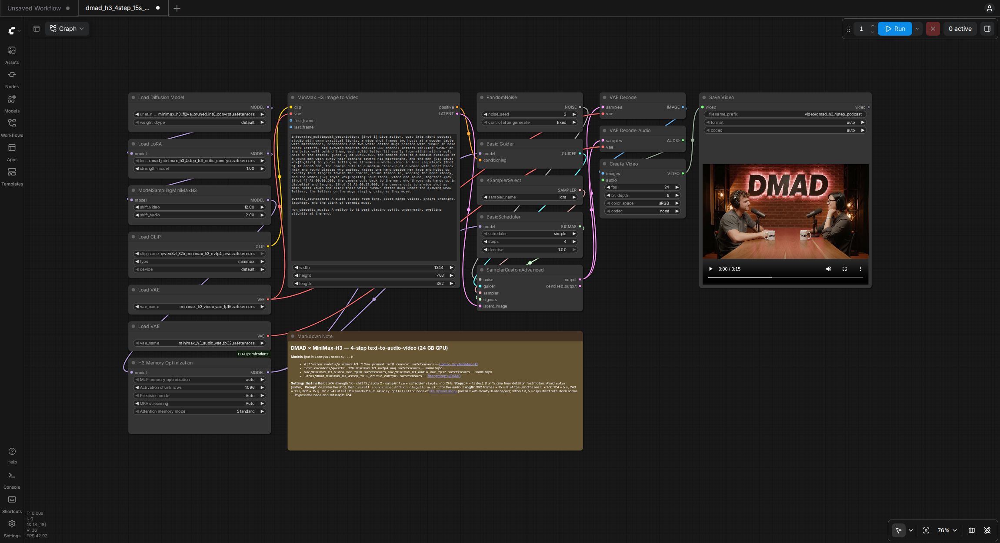
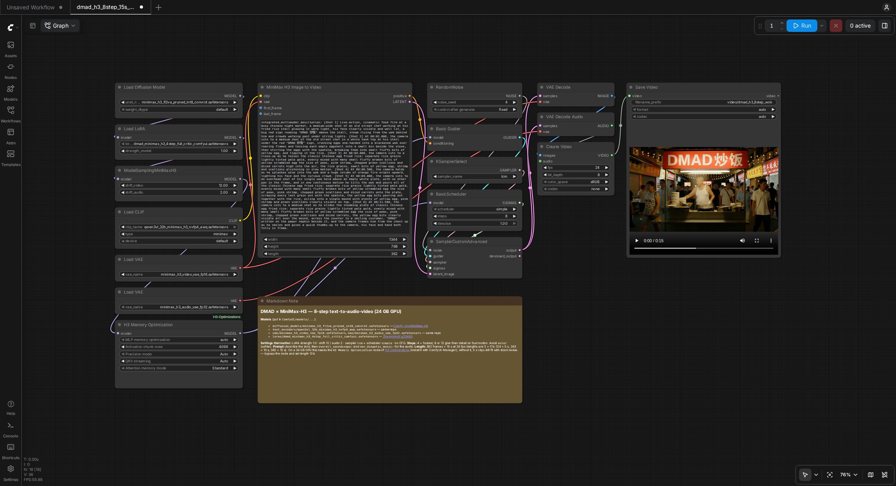

# ComfyUI

[`ComfyUI-DMAD`](ComfyUI-DMAD/) holds custom nodes that run the DMAD 4-step students of MiniMax-H3 in ComfyUI the way they were trained. ComfyUI's stock
`lcm` sampler with the `simple` scheduler (after `ModelSamplingMiniMaxH3`) implements the same rule and sigma grid and
gives bit-identical videos, so these nodes are a convenience; either works.

* **DMAD Sampler (re-noise)** — a `SAMPLER` for `SamplerCustom` / `SamplerCustomAdvanced`. At every step the model
  predicts the clean sample x0 and the next input is x0 re-noised with *fresh* noise at the next sigma
  (x' = (1 − σ') x0 + σ' ε), the DMD-style multistep rule the students were trained with (the same update as `lcm`). ODE samplers
  (euler, ...) step from x_t instead, which is not the students' operating point.
* **DMAD Sigmas** — the students' sigma grid: shifted linear from 1 to 0, shift 12 (video), `steps` model evaluations.

The ComfyUI-layout LoRAs, [`minimax_h3/dmad_minimax_h3_4step_{lora_critic,full_critic}_comfyui.safetensors`](https://huggingface.co/ZhengmingYu/DMAD/tree/main/minimax_h3)
on the Hugging Face repo, are exact conversions of the released LoRAs (rank 128; q/k/v fused block-diagonally into
`qkv_proj`, SwiGLU halves reordered; no merging or rank reduction), made with
[`tools/convert_lora_comfyui.py`](../tools/convert_lora_comfyui.py).

## Install

Copy or symlink [`ComfyUI-DMAD`](ComfyUI-DMAD/) into `ComfyUI/custom_nodes/` (optional, see above) and download the LoRAs:

```bash
cp -r comfyui/ComfyUI-DMAD /path/to/ComfyUI/custom_nodes/
wget -P /path/to/ComfyUI/models/loras https://huggingface.co/ZhengmingYu/DMAD/resolve/main/minimax_h3/dmad_minimax_h3_4step_full_critic_comfyui.safetensors
wget -P /path/to/ComfyUI/models/loras https://huggingface.co/ZhengmingYu/DMAD/resolve/main/minimax_h3/dmad_minimax_h3_4step_lora_critic_comfyui.safetensors
```

The base model, text encoder and VAEs are the
[Comfy-Org MiniMax-H3 repackage](https://huggingface.co/Comfy-Org/MiniMax-H3) (ComfyUI loads the `fl2va` or `ref2va`
partition; the students were trained on the text-to-audio-video transformer, see the note below).

## Ready-to-run workflows (24 GB GPU)

Two complete text-to-audio-video workflows in [`workflows`](workflows/) that make 15 s of 1344x768 video
with stereo audio on a 24 GB GPU. Load the `.json`, or drag the example `.mp4` (on the Hugging Face repo; it embeds the
workflow) into ComfyUI; missing models are offered for download from links stored in the workflow. Both sample with
stock nodes (`lcm` + `simple`, `full_critic` LoRA); the ComfyUI-DMAD nodes are not needed.

| | 4 steps | 8 steps |
|---|---|---|
| Workflow | [`dmad_h3_4step_15s_podcast.json`](workflows/dmad_h3_4step_15s_podcast.json) | [`dmad_h3_8step_15s_wok.json`](workflows/dmad_h3_8step_15s_wok.json) |
| Example (workflow embedded) | [`dmad_h3_4step_15s_podcast.mp4`](https://huggingface.co/ZhengmingYu/DMAD/resolve/main/minimax_h3/workflows/dmad_h3_4step_15s_podcast.mp4), seed 2 | [`dmad_h3_8step_15s_wok.mp4`](https://huggingface.co/ZhengmingYu/DMAD/resolve/main/minimax_h3/workflows/dmad_h3_8step_15s_wok.mp4), seed 4 |
| Output | 1344x768, 362 frames = 15 s at 24 fps, stereo audio | 1344x768, 362 frames = 15 s at 24 fps, stereo audio |
| Peak GPU memory | 24.6 GiB | 24.6 GiB |
| Time (H200, 24 GiB cap) | 448 s, of which sampling 393 s | 845 s, of which sampling 785 s |




| folder | file (from [Comfy-Org/MiniMax-H3](https://huggingface.co/Comfy-Org/MiniMax-H3) unless noted) |
|---|---|
| `models/diffusion_models/` | `minimax_h3_fl2va_pruned_int8_convrot.safetensors` |
| `models/text_encoders/` | `qwen3vl_32b_minimax_h3_nvfp4_awq.safetensors` |
| `models/vae/` | `minimax_h3_video_vae_fp16.safetensors`, `minimax_h3_audio_vae_fp32.safetensors` |
| `models/loras/` | `dmad_minimax_h3_4step_full_critic_comfyui.safetensors` ([ZhengmingYu/DMAD](https://huggingface.co/ZhengmingYu/DMAD/tree/main/minimax_h3)) |

Video lengths are 5 + 17k frames (124 = 5 s, 243 = 10 s, 362 = 15 s). On a 24 GB GPU, 15 s needs the
`H3 Memory Optimization` node of [H3-Optimizations](https://github.com/Zironic/H3-Optimizations) (install with
ComfyUI-Manager), which both workflows include. Without it, 5 s (length 124) fits in 24 GB with stock nodes only, and
15 s needs more than 32 GB (it fits in 40 GB); the video keeps its composition and action but is not bit-identical to
the one made with the memory node. Times are end to end (model loading, text encoding, sampling, decoding) on an H200
with the PyTorch allocator capped at 24 GiB; a consumer GPU is slower, and sampling time scales linearly with steps.

## Workflow (text-to-audio-video)

```
UNETLoader (minimax_h3_fl2va_*.safetensors)
  -> LoraLoaderModelOnly (dmad_minimax_h3_4step_lora_critic_comfyui.safetensors, strength 1.0)
  -> ModelSamplingMiniMaxH3 (shift_video 12.0, shift_audio 2.0)
  -> BasicGuider (conditioning from MiniMax H3 Image to Video / CLIPTextEncode with the minimax CLIP)
SamplerCustomAdvanced: noise = RandomNoise, guider as above, sampler = DMAD Sampler, sigmas = DMAD Sigmas (steps 4, shift 12)
                       (or sampler = KSamplerSelect lcm, sigmas = BasicScheduler simple, 4 steps: identical result),
                       latent_image = Empty MiniMax H3 AV Latent (1344 x 768, 124 frames)
  -> VAEDecode (video VAE) + VAEDecodeAudio (audio VAE) -> Create Video (24 fps) -> Save Video
```

Settings that matter: LoRA strength **1.0** (the LoRA is the distilled student, not a style), **cfg 1.0** (no
classifier-free guidance; H3 is guidance-distilled), `shift_audio` **2.0** (ComfyUI's H3 default is 3.0; the students
were trained with 2.0), **4 steps** with the DMAD Sigmas node. The students are trained in continuous time, so the
same sampler also supports more steps (`steps` in DMAD Sigmas; sampling time scales linearly): on prompts with fast
motion, 8 and 12 steps render the fast movements cleaner than 4-step.

## Re-noise sampling vs an ODE sampler

Measured in ComfyUI 0.38 (Comfy-Org `fl2va_bf16`, `full_critic` LoRA, 7 high-motion prompts, seed 42), mean
Laplacian variance of the frames as a sharpness proxy, DMAD sampler (= `lcm`) / euler at the same sigmas:

| steps | 2 | 4 | 6 | 8 | 10 | 12 | 25 |
|---|---|---|---|---|---|---|---|
| sharpness ratio | 1.02 | 1.09 | 1.09 | 1.18 | 1.13 | 1.15 | 1.12 |
| prompts where DMAD is sharper | 4/7 | 6/7 | 5/7 | 5/7 | 4/7 | 5/7 | 6/7 |

Visually, euler smears the fastest-moving limbs (a swordsman mid-strike, boxing gloves) where the re-noise sampler
keeps them crisp; the composition is the same with the same seed.

## Note on the base partition

ComfyUI ships the `fl2va` / `ref2va` partitions of MiniMax-H3 and uses them for text-to-video as well; the DMAD
students were trained on the `transformer/` (text-to-audio-video) partition of the original release. The LoRA loads
on all partitions (same architecture); results on `fl2va` / `ref2va` are what you get in ComfyUI, not the exact videos
of `inference.py`.
